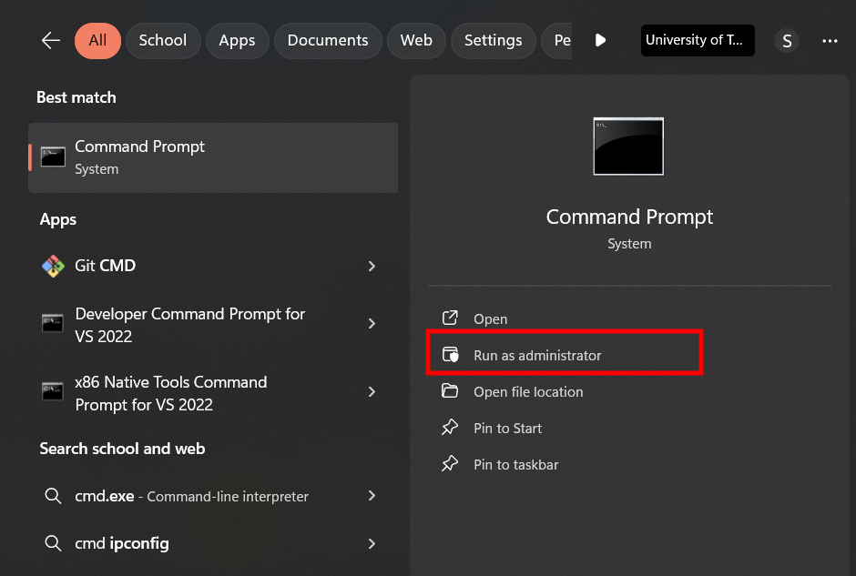
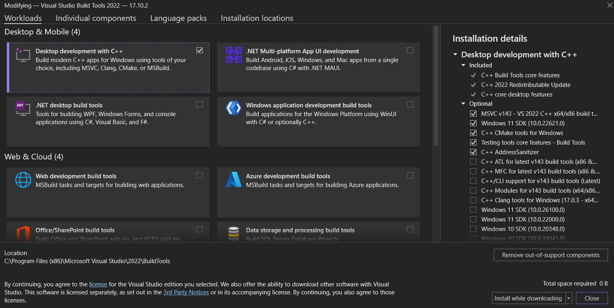

# Thermal RoI Tracking
This repository contains a GUI program that can:
- Load thermal videos captured using FLIR camera.
- User can create an oval on first frame of the video, containing region of interest
- The program uses a point tracking model (tapnet) to track the oval throughout the video
- It computes average values within RoI throughout the video and user can export it as excel file, and a scatter plot.
## Installation
**Note**: The project is tested on **Python 3.9**. It **might** work if you have python > 3.9 but definitily does not work if you have python < 3.9.


Download the FLIR SDK from [the official website](https://flir.custhelp.com/app/account/fl_download_software). After visiting the website, you have to:
- First select **SDK (Software Development Kits)**
- Then select **FLIR Science file SDK**
- Then install the SDK for the windows.

**Windows users**: Once you download the SDK file, there is a `.exe` file inside the compressed file you downloaded. Install it but remember the path you choose. After installation, if you choose the default path, then you can go to `C:\Program Files\FLIR Systems\sdks\file\python` to see where you can install SDK for python.  
For installing it, you have to run the command prompt as adiministrator from the search bar menu:

Then you have to change directory to where SDK is installed and install the SDK:
```
cd C:\Program Files\FLIR Systems\sdks\file\python
python setup.py install
```
**Note**: For the code above to work, it is expected that Microsoft Visual C++ is installed on computer. If not:
1. Download it from the [official website](https://visualstudio.microsoft.com/visual-cpp-build-tools/) by clicking on **Download Build Tools** button.
2. When installing, make sure **Desktop Development with C++** is activated and do not change anything from the installation details:



After installation of SDKs, install the dependancies related to python program by installing the packages with the command below inside the project directory:
```
pip install -r requirements.txt
pip install -r tapnet/requirements_inference.txt
```

Finally, download the checkpoints for point tracking [from here](https://storage.googleapis.com/dm-tapnet/bootstap/bootstapir_checkpoint_v2.npy) and place it under `tapnet/checkpoints` directory.